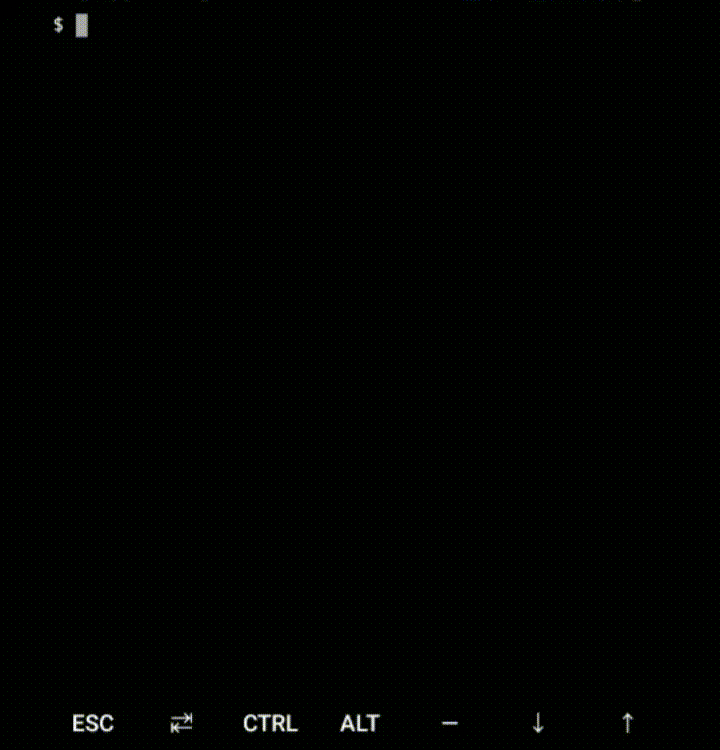

<link rel="stylesheet" href="docs/css/main.css" />
<div class="card">
  <p align="center">
    <a href="https://puneetgopinath.github.io/Sanitizers/docs">
      
    </a>
  </p>
  <h2 align="center">BK Sanitizers (BKS)</h2>

  

  <p align="center">
    <blockquote><b>Sanitizers is a community-developed, free and open source library for sanitizing user data in PHP.</b></blockquote>
    Tagline: Quickly Sanitize user data<br><br>
    An acronym or abbreviation for <b>B</b>aal-<b>K</b>rshna <b>Sanitizers</b> is BK Sanitizers
    <br><br>
    Latest release: <br>
    <br><br>See:<br>
    <a href="https://puneetgopinath.github.io/Sanitizers/docs"><b>Sanitizers Docs</b></a> &raquo;<br>
    <a href="https://github.com/PuneetGopinath/Sanitizers/wiki"><b>Sanitizers Wiki</b></a> &raquo;<br><br>
    Pages &rArr;
    <a href="https://github.com/PuneetGopinath/Sanitizers/issues/new?template=bug_report.md">Report bug(s)</a> • <a href="https://github.com/PuneetGopinath/Sanitizers/releases">Releases</a> • <a href="https://github.com/PuneetGopinath/Sanitizers/issues/new?template=feature_request.md">Request feature</a> • <a href="https://baalkrshna.hashnode.dev/series/bks">Blog</a>
  </p><br><br>
  <a href="https://twitter.com/intent/tweet?text=See%20this%20PHP%20Sanitizers%20on%20GitHub:&url=https%3A%2F%2Fgithub.com%2FPuneetGopinath%2FSanitizers&hashtags=php,backend,sanitizers,php-sanitize,developers"></a>
  <a href="https://gitter.im/BaalKrshna/Sanitizers?utm_source=badge&utm_medium=badge"></a>
  <a href="https://github.com/PuneetGopinath/Sanitizers/stargazers"></a>
  
</div>

<hr>

**Note**: See the [1.0-dev](https://github.com/PuneetGopinath/Sanitizers/tree/1.0-dev) branch, as main branch is developing 1.1.0 minor release so, readme and docs are not for 1.0 releases.
<details open="true">
    <summary>Table of contents</summary>

 * [Quick Start](#quick-start)
 * [Status](#status)
 * [About](#about)
 * [Visuals](#visuals)
 * [Files](#files)
 * [Prerequisites](#prerequisites)
 * [Tests](#tests)
 * [Contributing](#contributing)
 * [Community](#community)
 * [Authors](#authors)
 * [LICENSE](#license)
 * [Comparing](#comparing)
 * [Sponsor](#sponsor)
 * [Spread BK Sanitizers](#spread)
 * [CODE_OF_CONDUCT](#code-of-conduct)
 * [Versioning](#versioning)
 * [Conclusion](#conclusion)

</details>

<h2><a name="quick-start">Quick Start 🚀</a></h2>

- [Download the latest version](https://github.com/PuneetGopinath/Sanitizers/archive/v1.0.1.zip)

- ### Clone the repo:

`git clone https://github.com/PuneetGopinath/Sanitizers.git` OR `gh repo clone PuneetGopinath/Sanitizers`

- ### Installation 🔧

See [INSTALL.md](INSTALL.md) file for Installation guide.

- ### Usage

Just include the file and Sanitize the user input.
- Example Usage without composer autoload:

```php
<?php
// Import classes
use Sanitizers\Sanitizers\Sanitizer;

require "src/Sanitizers.php";

// passing `true` in Sanitize class enables exceptions
$sanitizer = new Sanitizer(true);
try {
    echo $sanitizer->sanitize("username", $_GET["username"]);
} catch (Exception $e) {
    echo "Could not Sanitize user input.";
    echo $e->getMessage();
}
?>
```

- Example Usage with composer autoload:

```php
<?php
// Import classes
use Sanitizers\Sanitizers\Sanitizer;

require "vendor/autoload.php";

$sanitizer = new Sanitizer(true);
try {
    echo $sanitizer->sanitize("username", $_GET["username"]);
} catch (Exception $e) {
    echo "Could not Sanitize user input.";
    echo $e->getMessage();
}
?>
```

<h2><a name="status">Status</a></h2>

[](https://gitter.im/BaalKrshna/Sanitizers?utm_source=badge&utm_medium=badge&utm_campaign=pr-badge&utm_content=badge)
[](https://app.fossa.com/projects/git%2Bgithub.com%2FPuneetGopinath%2FSanitizers?ref=badge_shield)

#### Workflows


#### GitHub


[](https://github.com/PuneetGopinath/Sanitizers/releases)
[](https://github.com/PuneetGopinath/Sanitizers/issues)
[](https://github.com/PuneetGopinath/Sanitizers/pulls)
[](https://github.com/PuneetGopinath/Sanitizers/releases)

[]()
[]()
[]()
[]()

#### Packagist

[](https://packagist.org/packages/sanitizers/sanitizers)
[](https://packagist.org/packages/sanitizers/sanitizers)
[](https://packagist.org/packages/sanitizers/sanitizers)
[](//packagist.org/packages/sanitizers/sanitizers)
[](//packagist.org/packages/sanitizers/sanitizers)
[](//packagist.org/packages/sanitizers/sanitizers)

#### Stargazers

👏 Thank you very much stargazers ⭐ !!

You have proved that BK Sanitizers has some value !!

[](https://github.com/PuneetGopinath/Sanitizers/stargazers)

#### Stargazers over time

[](https://starchart.cc/PuneetGopinath/Sanitizers)

<!--[](https://stars.medv.io/PuneetGopinath/Sanitizers)

#### Contributors

Thanks to all contributors !!

[](https://github.com/PuneetGopinath/Sanitizers/contributors)-->

<h2><a name="about">About ℹ️</a></h2>

- ### What is Sanitize ??

/ˈsanɪtʌɪz/ - to make something completely clean and free from bacteria.<br>

> In web development to sanitize means that you remove unsafe characters from the input.<br>
> Sanitize is a function to check (and remove) harmful data (which can harm the software) from user input.<br>
> Sanitizing user input is the most secure method of user input validation to strip out anything that is not on the whitelist.<br>

- ### When and why should I use Sanitizers ?

> Whenever you store user's data (in database or anywhere), or if that data will be read/available to (unsuspecting) users, then you have to sanitize it.<br>
> See also HTML_sanitization in
[wikipedia](https://en.m.wikipedia.org/wiki/HTML_sanitization)<br>

- ### What is XSS ??

XSS stands for Cross Site Scripting.

- ### How can I clean user input 🧹 ?

 * First, Sanitize
 * Then, Validate
 * Last, Escape output.


<h2><a name="visuals">Visuals 📽️</a></h2>

- ### Testing with and without composer autoload in Termux (on Android)



I ran:
```bash
composer validate # Validates composer.json
composer test # Test without composer autoload
composer update # Update dependencies and install autoload
composer test # Test with composer autoload
```

<h2><a name="files">Files 🗃️</a></h2>

```text
Sanitizers/
└── src/
    ├── Sanitizers.php
    └── config.ini
    └── bootstrap.php
└── examples/
    └── README.md
    └── extending.php
    └── confirm-reg.php
    └── contact-form.php
    └── login.php
    └── register.php
└── test/
    └── SanitizersTest.php
    └── README.md
```

<h2><a name="prerequisites">Prerequisites 📋</a></h2>

See Prerequisites section [in INSTALL.md](INSTALL.md#prerequisites).

<h2><a name="tests">Tests ⚙️</a></h2>

Run either `composer run-script test` or `php test/SanitizersTest.php debug`

<h2><a name="contributing">Contributing</a></h2>

Plz read [CONTRIBUTING.md](.github/CONTRIBUTING.md)</a> file.

<h2><a name="community">Community 💬</a></h2>

Get updates on Sanitizers's development and chat with the BKS maintainers and community members.

- Chat in IRC. On the `irc.freenode.net` server, in the `#bksanitizers` channel.
- Also you can chat in [gitter](https://gitter.im/BaalKrshna/Sanitizers)
- Follow our blog on [hashnode.dev](https://baalkrshna.hashnode.dev)

<h2><a name="authors">Authors ✒️</a></h2>

 * Puneet Gopinath - [PuneetGopinath](https://github.com/PuneetGopinath)

See also the list of [contributors](https://github.com/PuneetGopinath/Sanitizers/graphs/contributors) who participated in building this project.

<h2><a name="license">LICENSE 📄</a></h2>

MIT License. Read [LICENSE](LICENSE) file.
[](https://app.fossa.com/projects/git%2Bgithub.com%2FPuneetGopinath%2FSanitizers?ref=badge_large)

<h2><a name="comparing">Comparing 😕</a></h2>

#### Are you comparing BKS library with HTMLPurifier ??

Then, you need to know difference between HTMLPurifier and BKS

1. HTMLPurifier aims at creating safe and valid HTML as close as possible to a given input. But we aim to cover all types of input like name, username, password, etc

<h2><a name="sponsor">Sponsor</a></h2>

Support BK Sanitizers by becoming a sponsor.
Your name will be displayed here.

Just click the "Sponsor" button [on our GitHub repo](https://github.com/PuneetGopinath/Sanitizers).

[Become a sponsor](https://patreon.com/PuneetGopinath)

<h2><a name="spread">Spread BK Sanitizers! 🎉</a></h2>

This is optional (we don't force you anything) and you can also try to give at least a star.

Help spread awareness about BK Sanitizers by:

 * Share in social media platforms.
 * Add BK Sanitizers in your site's credits list **OR** add `Powered by <a href="https://github.com/PuneetGopinath/Sanitizers/">BK Sanitizers</a>`.
 * Give a star in GitHub

<h2><a name="code-of-conduct">CODE_OF_CONDUCT</a></h2>

Plz read [CODE_OF_CONDUCT.md](CODE_OF_CONDUCT.md) for our CODE OF CONDUCT.

<h2><a name="versioning">Versioning</a></h2>

We use [Semantic Versioning](https://semver.org) for our library.

<h2><a name="conclusion">Conclusion 🏁</a></h2>

If you sanitize user input then, you will be able to manage data properly, validate it, show it in a secure and reliable way.

It makes your web application trustworthy, so it must be one of your main goals from the beginning of your career as a web developer.
