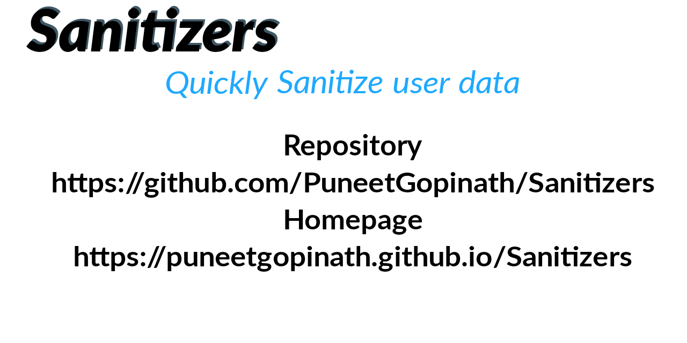
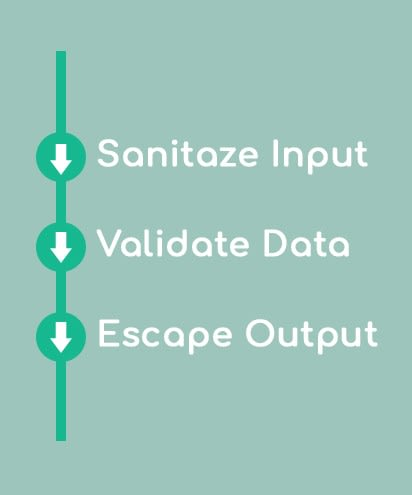

<link rel="stylesheet" href="docs/css/main.css" />
<div class="card">
  <p align="center">
    <a href="https://puneetgopinath.github.io/Sanitizers/docs">
      
    </a>
  </p>
  <h2 align="center">BK Sanitizers (BKS)</h2>

  <p align="center">
    Quickly Sanitize user data<br><br>
    Sanitizers is also called as BK Sanitizers (<b>B</b>aal-<b>K</b>rshna <b>Sanitizers</b>)<br><br>
    <br><br>See:<br>
    <a href="https://puneetgopinath.github.io/Sanitizers/docs"><b>Sanitizers Docs</b></a> &raquo;<br>
    <a href="https://github.com/PuneetGopinath/Sanitizers/wiki"><b>Sanitizers Wiki</b></a> &raquo;<br><br>
    Pages &rArr;
    <a href="https://github.com/PuneetGopinath/Sanitizers/issues/new?template=bug_report.md">Report bug(s)</a> • <a href="https://github.com/PuneetGopinath/Sanitizers/releases">Releases</a> • <a href="https://github.com/PuneetGopinath/Sanitizers/issues/new?template=feature_request.md">Request feature</a>
  </p><br>
</div>

<hr>

# Table of contents

 * [Quick Start](#quick-start)
 * [Status](#status)
 * [About](#about)
 * [Files](#files)
 * [Prerequisites](#prerequisites)
 * [Tests](#tests)
 * [Contributing](#contributing)
 * [LICENSE](#license)
 * [Conclusion](#conclusion)

<h2><a name="quick-start">Quick Start 🚀</a></h2>

- [Download the latest version](https://github.com/PuneetGopinath/Sanitizers/archive/v1.0.2.zip)

- ### Clone the repo:

`git clone https://github.com/PuneetGopinath/Sanitizers.git`

- ### Installation 🔧

See [INSTALL.md](INSTALL.md) file for Installation guide.

- ### Usage

Just include the file and Sanitize the user input.
- Example Usage without composer autoload:

```php
<?php
// Import classes
use Sanitizers\Sanitizers\Sanitizer;

require "src/Sanitizers.php";

// passing `true` in Sanitize class enables exceptions
$sanitizer = new Sanitizer(true);
try {
    echo $sanitizer->Username($_GET["username"]);
} catch (Exception $e) {
    echo "Could not Sanitize user input.";
    echo $e->getMessage();
}
?>
```

- Example Usage with composer autoload:

```php
<?php
// Import classes
use Sanitizers\Sanitizers\Sanitizer;

require "vendor/autoload.php";

$sanitizer = new Sanitizer(true);
try {
    echo $sanitizer->Username($_GET["username"]);
} catch (Exception $e) {
    echo "Could not Sanitize user input.";
    echo $e->getMessage();
}
?>
```

<h2><a name="status">Status</a></h2>

[](https://gitter.im/BaalKrshna/Sanitizers?utm_source=badge&utm_medium=badge&utm_campaign=pr-badge&utm_content=badge)
[](https://app.fossa.com/projects/git%2Bgithub.com%2FPuneetGopinath%2FSanitizers?ref=badge_shield)

#### Workflows


#### GitHub

[](https://github.com/PuneetGopinath/Sanitizers/releases)
[](https://github.com/PuneetGopinath/Sanitizers/stargazers)
[]()
[](https://github.com/PuneetGopinath/Sanitizers/releases)

[]()
[]()
[]()
[]()


#### Packagist

[](https://packagist.org/packages/sanitizers/sanitizers)
[](https://packagist.org/packages/sanitizers/sanitizers)
[](https://packagist.org/packages/sanitizers/sanitizers)
[](https://packagist.org/packages/sanitizers/sanitizers)
[](https://packagist.org/packages/sanitizers/sanitizers)
[](https://packagist.org/packages/sanitizers/sanitizers)
[](https://packagist.org/packages/sanitizers/sanitizers)
[](https://packagist.org/packages/sanitizers/sanitizers)

#### Stargazers

👏 Thank you very much stargazers ⭐ !!

You have proved that BK Sanitizers has some value !!

[](https://github.com/PuneetGopinath/Sanitizers/stargazers)

#### Stargazers over time

[](https://starchart.cc/PuneetGopinath/Sanitizers)

<h2><a name="about">About ℹ️</a></h2>

- ### What is Sanitize ??

/ˈsanɪtʌɪz/ - to make something completely clean and free from bacteria.<br>

> In web development to sanitize means that you remove unsafe characters from the input.<br>
> Sanitize is a function to check (and remove) harmful data (which can harm the software) from user input.<br>
> Sanitizing user input is the most secure method of user input validation to strip out anything that is not on the whitelist.<br>

- ### When and why should I use Sanitizers ?

> Whenever you store user's data (in database or anywhere), or if that data will be read/available to (unsuspecting) users, then you have to sanitize it.<br>
> See also HTML_sanitization in
[wikipedia](https://en.m.wikipedia.org/wiki/HTML_sanitization)<br>

- ### What is SQL injection ??

SQL injection is a method used by hackers to inject malicious SQL codes while running SQL query.

- ### How can I clean user input 🧹 ?

 * First, Sanitize
 * Then, Validate
 * Last, Escape output.


<h2><a name="files">Files 🗃️</a></h2>

```text
Sanitizers/
└── src/
    ├── Sanitizers.php
    └── config.ini
    └── bootstrap.php
└── examples/
    └── README.md
    └── confirm-reg.php
    └── contact-form.php
    └── login.php
    └── register.php
└── test/
    └── SanitizersTest.php
    └── README.md
```

<h2><a name="prerequisites">Prerequisites 📋</a></h2>

 * #### PHP
Minimum we need php 5.4.0 for Sanitizers to work.
 * #### PHP Extensions
You need filter and mbstring extension.

<h2><a name="tests">Tests ⚙️</a></h2>

Run either `composer run-script test` or `php test/SanitizersTest.php`

<h2><a name="contributing">Contributing</a></h2>

Plz read [CONTRIBUTING.md](.github/CONTRIBUTING.md)</a> file.

<h2><a name="license">LICENSE 📄</a></h2>

MIT License. Read [LICENSE](LICENSE) file.
[](https://app.fossa.com/projects/git%2Bgithub.com%2FPuneetGopinath%2FSanitizers?ref=badge_large)

<h2><a name="conclusion">Conclusion 🏁</a></h2>

If you sanitize user input then, you will be able to manage data properly, validate it, show it in a secure and reliable way.

It makes your web application trustworthy, so it must be one of your main goals from the beginning of your career as a web developer.
