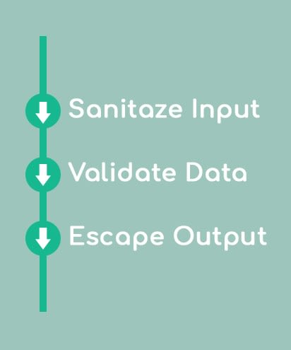

<h2 align="center">BK Sanitizers Docs - FAQ</h2>

<link rel="stylesheet" href="https://puneetgopinath.github.io/Sanitizers/css/main.css" />

To know the frequently asked questions to BKS read this file.

The Frequently Asked Questions are:

## What is XSS ??

XSS stands for Cross Site Scripting.

## What is Sanitize ??

/ˈsanɪtʌɪz/ - to make something completely clean and free from bacteria. 

> In web development to sanitize means that you remove unsafe characters from the input.

Sanitize is a function to check (and remove) harmful data (which can harm the software) from user input. 
Sanitizing user input is the most secure method of user input validation to strip out anything that is not on the whitelist. 

## When and why should I use Sanitizers ?

Whenever you store user's data (in database or anywhere), or if that data will be read/available to (unsuspecting) users, then you have to sanitize it. 
See also HTML_sanitization in
[wikipedia](https://en.m.wikipedia.org/wiki/HTML_sanitization) 

## How can I clean user input ?

1. First, Sanitize
2. Then, Validate
3. Last, Escape output.

## What are the important things to do for preventing XSS ?

1. Always sanitize and validate all user input.
2. [Add a strict Content Security Policy (CSP)](https://web.dev/strict-csp/).

## When do XSS vulnerabilities arise?

They usually arise from:

 * Allowing user input to be add to your html code. (Use HTMLPurifier)
 * Allowing users to upload HTML/SVG files and serving those back unsafely (Use HTMLPurifier/SVG sanitizer).
 * Passing user input into executable functions/properties in JS. (Use Any Sanitizer like BK Sanitizers)
 * Loading scripts from untrusted website. (You have to trust that website, we can't do anything)

## What are the main things to sanitize?

You can sanitize all the external sources before using any of them:

1. $_SERVER
2. $_POST
3. $_GET
4. $_COOKIE
5. $_REQUEST (commonly not used)
6. Data taken from databases
7. APIs
8. Input data from the clients
9. $argv
10. http://php://stdin
11. http://php://input

We are planning to create a new library AutoSanitize for sanitizing these variables. 
If you are interested, send us a mail at [baalkrshna@gmail.com](mailto:baalkrshna@gmail.com\&subject=I%20am%20interested%20in%20AutoSanitize%20library\&cc=\&bcc=\&body=Hi%20BKS%20maintainers%21%0D%0AI%20am%20interested%20in%20AutoSanitize%20library%0D%0A%0D%0AThank%20you%2C%0D%0AYour%20name), Click on email address the subject and body is automatically added you can modify it. Note: Replace `Your name` with your name.

---------------------------------------------------------------------

[Back to home](README.md)
